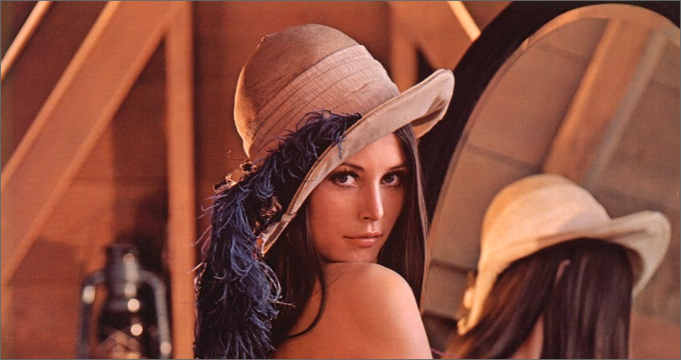

# JPEG DECODER

a simple jpeg decoder, implement from zero to learn its compress algorithm.

参考了一些网络上的JPEG文章，并未参考其实现，在实现上均按自己的理解进行，由于是以学习为目的，所以代码尽可能表达解码流程，对内存管理及计算不做任何优化

## 进度

1. 区段解析
2. SOF0解析
3. DQT解析
4. DHT解析
5. SOS解析
6. 图像解析

## 目前状态

可以正常解析部分图像了！

## 这个解码器还有哪些工作没有做？

1. 仅为baseline支持
2. 未对右侧及下侧超出不满一个block的部分进行处理
3. 一个DHT段可能包含多个DHT表，这里也没有进行处理
4. 未对可能出现的RSTn进行处理

## ~~为何解码出来的图像不正常？~~

__旧的分析__

从上面给出的例子来看，大体上是可以看出基本正确的，但有些色块不正常，目前没有时间进行完善修复了，这里记录当前的分析过程

1. 在IDCT之后，分别对Cb和Cr分量+了128，最终Cb和Cr分量看起来应该是正确的了
2. 尝试对Y也+128，但会发现，现在正常的色块与异常的色块会交换
3. 因此中间得到的一个粗糙的结论是，Y分量部分为-128\~127，另一部分为0\~255，这明显是不合理的
4. 回溯分析到读取block结束的部分，此时会获取所有MCU的所有block的直流分量和交流分量，发现是存在一些不正常的：
  - Y分量的直流分量越来越大，到最后已经达到了30000以上，而Cb和Cr均没有这样的情况

__分析__

问题已经解决了，原因很蠢，就是在处理直流分量时，mask由传入的16位误写为了8位，导致数据异常，就是本来是一个负数，但是经过一个8位的mask之后前面的符号位都被置0了，导致变成了正数，进而导致直流分量错误无限积累。而在这个过程中，Cb和Cr的直流分量的变化量没有那么大，导致最终没有出现异常

## 粗略写一下解析流程

这部分互联网上资料比较多，也可以参考最下方的文章，因此暂时粗略叙述方便回忆

一些前置知识：

JPEG编码的流程大概为：

  - 颜色空间转换：RGB -> YCbCr，RGB好理解，Y为亮度信息，Cb和Cr为色度和饱和度，人眼对亮度敏感，对色度和饱和度不敏感，因此图像、视频压缩一般都会在这里做文章，举例来说，同尺寸的YCbCr420图像比RGB要少一半的数据量
  - 降采样：444 -> 444/422/420，444即4个Y对应了4个Cb、4个Cr，这种情况就是没有进行降采样，422即4个Y对应2个Cb和2个Cr，420即4个Y对应1个Cb和1个Cr，具体采样方式要看SOF0
  - DCT变换
  - 量化
  - 霍夫曼编码

编码时是以MCU（Minimum Coding Unit），每个MCU中包含多个block，包含几个block要看SOF0，比如说Y分量的采样率为2和2，Cb和Cr的采样率都为1和1，那么一个MCU中将包含6个block，4个Y的，1个Cb的，1个Cr的。

MCU的排列为一行一行一行的，MCU中的block也为一行一行一行的，举例：

- `MCU[0][0].block[Y][0][0]`
- `MCU[0][0].block[Y][0][1]`
- `MCU[0][0].block[Y][1][0]`
- `MCU[0][0].block[Y][1][1]`
- `MCU[0][0].block[Cb][0][0]`
- `MCU[0][0].block[Cr][0][0]`
- `MCU[0][1].block[Y][0][0]`
- `MCU[0][1].block[Y][0][1]`
- `MCU[0][1].block[Y][1][0]`
- `MCU[0][1].block[Y][1][1]`
- `MCU[0][1].block[Cb][0][0]`
- `MCU[0][1].block[Cr][0][0]`

1. 首先将图像数据读进内存准备处理
2. JPEG分成了许多段，每个段都以0xFF做分隔，0xFF后面一个字节标识了该段的作用，需要注意的是，在图像的压缩数据部分，也会存在0xFF，但这个0xFF是编码数据，因此JPEG标准中规定，需要对每个0xFF后面填充一个0x00，在解码时需要跳过该填充字节
3. 主要需要进行解析的有以下几段：
  - SOI(0xD8)：start of image，文件头，没有其它数据
  - EOI(0xD9)：end of image，文件尾，没有其它数据
  - APPn(0xEn)：application n，包含一些元数据，这里不做解析
  - SOF0(0xC0)：start of image 0，0为baseline
  - DQT(0xDB)：define quantization table，量化表数据
  - DHT(0xC4)：define huffman table，霍夫曼表
  - SOS(0xDA)：start of scan，一些图像参数，后面就是图像数据了
4. 解析DQT，根据参数，按字节（或双字节）依次读取即可，最终得到的就是一个8x8的表，每个表会有一个id，这个读取是比较简单的
5. 读取DHT，重点在于读取叶子节点个数以及重建霍夫曼表部分。霍夫曼编码是一种变长编码，基本思路是按值的频率，出现频率越高的值，其编码码字越短，其构建方式也可以保证依次按bit读取时不会出现短码字与长码字的冲突，这里会存在一个颜色分量id和直流交流类型，颜色分量id表明不同的颜色分量将使用不同的霍夫曼表来进行解析，直流交流类型表明直流与交流分量也需要使用不同的霍夫曼表，一般会有4个霍夫曼表，分别提供给Y/CbCr以及DC/AC进行解析，另外需要注意，有可能一个DHT段中包含多个霍夫曼表，也可能一个段中只包含一个，本项目中只处理了后面一种简单的情况
  - 首先从0开始，没有长度为1的码字，然后继续分析
  - 如果相同长度还有码字，那么+1，比如长度为2的有3个，则分别为00、01、10，接下来
    - 如果存在长度为3的码字，那么长度为3的码字将由110开始，即长度为2的最后一个码字+1再在后面补一个0
    - 如果不存在长度为3的码字，存在长度为4的码字，那么长度为4的码字将由1100开始
  - 也就是说，当前长度层如果存在码字，那么下一长度将由当前长度的最后一个码字+1再补0，如果不存在，则直接补0，考虑霍夫曼编码原理，是可以理解这样处理的原因的

IDCT:

$$ result[i][j] = \frac{1}{4}\sum{_{x=0} ^7}\sum{_{y=0} ^7}C_x C_y cos(\frac{(2i + 1)x\pi}{16}) cos (\frac{(2j + 1)y\pi}{16}) block[x][y] 
$$
$$
C_0 = \frac{1}{\sqrt{2}}​
$$
$$
C_i = 1, \forall i > 0
$$

